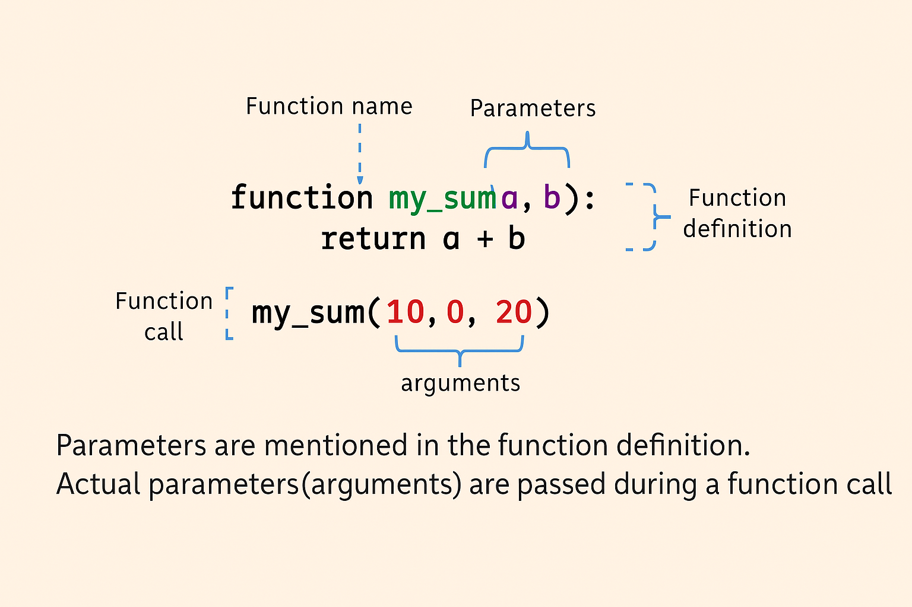

# 📘 Day 10 Journal – JavaScript - Functions

## ✅ What I Did Today
Today was another solid step forward in my JavaScript journey. I focused on deepening my understanding of basic functions and how they behave across different scopes and styles.

---
## Functions
- **Functions** are reusable pieces of code that perform a specific task or calculate a value

### Regular Function
- **Function call**, or invocation, is when we use or execute the function by referencing the function name followed by a set of `()`
- **Parameters** are placeholders for the values that will be passed to the function when it is called
- **Arguments** are the actual values passed to the function when it is called



### Arrow Function
Most of the syntax in arrow function will look similar to regular function, except for missing function keyword and the addition of the arrow `=>` between the `name` parameter and the function body
```js
const greetings = (name) => {
  console.log("Hello, " + name + "!");
};
```
Note
1. If your parameter list only has **1 parameter**, you can remove the `()`
2. If your arrow has no parameters, then `()` is a **must**
3. If function body contains a single line of code and parameter list only has 1 parameter, you can remove `()`, `{}`
4. If function body contains a single line of code, you can remove `{}`, and `return` keyword

```js
Example 1
const greetings = name => {
  console.log("Hello, " + name + "!");
};

Example 2
const greetings = () => {
  console.log("Hello");
};

Example 3:
const greetings = name => console.log("Hello, " + name + "!");

Example 4:
const calculatedArea = (a,b) => a * b
```

### Anonymous function
Anonymous function is a function without a name that can be assigned to a variable
```js
const sum = function (num1, num2) {
  return num1 + num2;
};
console.log(sum(3, 4)); // 7
```
### Function support default parameters
This function allow you to set default values for parameters
- If no argument is passed during the function call, the default value will be used.
- If an argument is provided (like `"Anna"`), it overrides the default.
```js
function greetings(name = "Guest") {
  console.log("Hello, " + name + "!");
}
greetings(); // Hello, Guest!
greetings("Anna"); // Hello, Anna!
```
### No `return` statement Function
A default return value of a function without `return` statement is `undefined`

--- 

##  Global vs Local vs Block Scope

### Global Scope
- Global scope is the outermost scope in a JavaScript program. - Variables declared in the global scope are accessible from anywhere in your code, including within functions and blocks
```js
//Create a global variable, outside of function
let globalVar = "I'm a global variable";

function printGlobalVar() {
    console.log(globalVar);
}

printGlobalVar(); // Output: "I'm a global variable"
```
### Local Scope
Local scope refers to variables that are only accessible within a function. 
```js
function greet() {
    // Create a local variable inside a function
    let message = "Hello, local scope!";
    console.log(message);
}

greet(); // Output: "Hello, local scope!"
console.log(message); // This will throw a Reference error as message is not a global variable
```
### Block Scope
A block scope  is any code section within curly braces, `{}`, such as in `if` statements, `for` loops, or `while` loops.
```js
// Create a variable inside a curly braces, aka if statements
if (true) {
    let blockVar = "I'm in a block";
    console.log(blockVar); // Output: "I'm in a block"
}
console.log(blockVar); // This will throw a Reference error
```