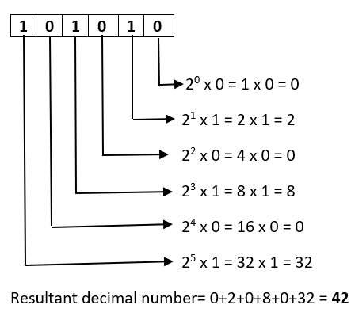

# 📘 Day 9 Journal – JavaScript - Booleans & Numbers

## ✅ What I Did Today
Today was all about sharpening my understanding of how JavaScript thinks. I explored the full spectrum of operators (**arithmetic, comparison, logical, bitwise and compound assignment**), and how they shape the decisions and calculations behind every line of code.

I practiced building **conditional statements and switch cases**, which felt like giving my programs the ability to make choices. It’s empowering to see how a few lines of logic can control entire flows of behavior.

I also got familiar with some quirky but powerful tools like `isNaN, parseInt, and toFixed`, which help wrangle numbers and user input with precision. These small utilities make a big difference when building real-world applications.

Looking at my project folder, I’m proud of how much ground I’ve covered, from basic math operations to branching logic. Each `.js` file is a snapshot of progress, and I’m starting to see how these pieces will eventually fit into larger, interactive projects.

In the next coming days, I’ll be diving into reference data types: `objects`, `arrays`, and `functions`. I’m excited to move from raw logic into structured data and reusable components. The foundation is set, and the real building begins.

---

## 📌 Arithmetic Operators in JavaScript

JavaScript provides a set of arithmetic operators to perform basic mathematical operations. These are commonly used in calculations, loops, and logic.

#### List of Arithmetic Operators

| Operator        | Symbol | Description                          | Example       | Result |
|-----------------|--------|--------------------------------------|---------------|--------|
| Addition        | `+`    | Adds two values                      | `5 + 3`       | `8`    |
| Subtraction     | `-`    | Subtracts one value from another     | `10 - 4`      | `6`    |
| Multiplication  | `*`    | Multiplies two values                | `6 * 2`       | `12`   |
| Division        | `/`    | Divides one value by another         | `9 / 3`       | `3`    |
| Modulus         | `%`    | Remainder of division                | `10 % 3`      | `1`    |
| Exponentiation  | `**`   | Raises a number to a power           | `2 ** 3`      | `8`    |
| Increment       | `++`   | Adds 1 to a variable                 | `let x = 5; x++` | `6` |
| Decrement       | `--`   | Subtracts 1 from a variable          | `let y = 5; y--` | `4` |

#### Notes
- JavaScript engine follows a system called **operator precedence** to determine the order of operations

- **Modulus `%`** is useful for checking even/odd:
  ```js
  if (num % 2 === 0) {
    console.log("Even");
  }
  ```
---
## 📌 What Happens in Calculations with Numbers and Strings?
JavaScript is loosely typed, which means it tries to **coerce types** when performing operations. This can lead to unexpected results when combining numbers and strings.

#### Addition (+) → String Concatenation
If either operand is a string, JavaScript treats + as a string concatenation operator.
```js
5 + "3" // "53"
7+"Hello"  // "7Hello"
```
The number is converted to a string.
The result is a string, not a number.

#### Other Operators (-, *, /, %) → Numeric Coercion
These operators force strings to behave like numbers, if possible.
```
"10" - 2     // 8
"6" * "3"    // 18
"20" / "4"   // 5
"10" % 3     // 1
```
#### Invalid Strings → NaN, <code>number</code> type
```js
const subtractionResult = 'abc' - 5;
console.log(subtractionResult); // NaN
console.log(typeof subtractionResult); // number
```
JavaScript tries to convert strings to numbers.
If successful, it performs the calculation.
If not, the result is NaN.

#### Booleans → Numeric Coercion
JavaScript treats booleans as numbers in mathematical operations:
- true = 1
- false = 0
```js
true + 1        // 2      → true is coerced to 1
false + 1       // 1      → false is coerced to 0
"Hello" + true  // "Hellotrue" → true is treated as a string due to + with a string
"Hello" - true // NaN → true is treated as a number because - forces numeric conversion, so "Hello" string becomes NaN
```
#### Mixed Chaining
Mixed chaining refers to using multiple operands of different types (e.g., strings, numbers, booleans) in a single expression

*Common Pitfalls*
1. Left-to-right evaluation means early coercion affects the rest of the chain.
2. Once a string enters the mix, everything after tends to be treated as a string.
```
console.log("Result: " + 10 + 5); // "Result: 105"
```
3. Parentheses are your best friend for controlling evaluation order.
```
console.log("Result: " + (10 + 5)); // "Result: 15"
```
---
## 📌 Operator Precedence
Operator precedence determines the order in which operations are evaluated in an expression.

#### Precedence Table (High to Low)

| Precedence | Operator(s)                  | Description                        | Example                | Result |
|------------|------------------------------|------------------------------------|-------------------------|--------|
| 1          | `()`                         | Grouping (Parentheses)             | `(2 + 3) * 4`           | `20`   |
| 2          | `++`, `--`                   | Increment / Decrement              | `let x = 5; x++`        | `6`    |
| 3          | `!`, `+`, `-` (unary)        | Logical NOT, Unary plus/minus      | `-3 + 5`                | `2`    |
| 4          | `**`                         | Exponentiation, in case multi exponentiation JS evaluate the rightmost exponentiation first                      | `2 ** 2 ** 2`                | `16`    |
| 5          | `*`, `/`, `%`                | Multiplication, Division, Modulus  | `10 / 2 * 3`            | `15`   |
| 6          | `+`, `-`                     | Addition, Subtraction              | `10 + 5 - 3`            | `12`   |
| 7          | `<`, `>`, `<=`, `>=`         | Comparison                         | `5 < 10`                | `true` |
| 8          | `===`, `!==`, `==`, `!=`     | Equality                           | `"5" == 5`              | `true` |
| 9          | `&&`                         | Logical AND                        | `true && false`         | `false`|
| 10         | <code>\|\|</code>                         | Logical OR                         | `true \|\| false`         | `true` |
| 11         | `=`, `+=`, `-=` (assignment) | Assignment     

---
#### What is the difference between <code>++y</code>vs <code>y++</code>?

Prefix <code>++y</code>: increment y first, then use it
Postfix <code>y++</code>: returns the current value of the variable first, then increases it

```js
let x = 5;
console.log(--x); // 4
console.log(x); // 4

let y = 5;
console.log(y--); // 5
console.log(y); // 4
```
---
## 📌 Compound Assignment Operators

Compound assignment operators allow you to perform a mathematical operation and reassign the result back to the variable in one line of code

| Operator | Description                  | Example     | Equivalent To   |
|----------|------------------------------|-------------|-----------------|
| `+=`     | Addition assignment           | `x += 5`     | `x = x + 5`     |
| `-=`     | Subtraction assignment        | `x -= 3`     | `x = x - 3`     |
| `*=`     | Multiplication assignment     | `x *= 2`     | `x = x * 2`     |
| `/=`     | Division assignment           | `x /= 4`     | `x = x / 4`     |
| `%=`     | Modulus assignment            | `x %= 2`     | `x = x % 2`     |
| `**=`    | Exponentiation assignment     | `x **= 3`    | `x = x ** 3`    |
---
## 🔍 Comparison Operators

Comparison operators are used to compare two values. They return a **boolean** (`true` or `false`) based on the result of the comparison.


#### Equality Operators

| Operator | Name               | Description                                      | Example            | Result |
|----------|--------------------|--------------------------------------------------|---------------------|--------|
| `==`     | Loose Equality      | Compares values after **type coercion**          | `"5" == 5`          | `true` |
| `===`    | Strict Equality     | Compares values **and types**                    | `"5" === 5`         | `false` |


#### Inequality Operators

| Operator | Name                | Description                                      | Example            | Result |
|----------|---------------------|--------------------------------------------------|---------------------|--------|
| `!=`     | Loose Inequality     | Returns `true` if values are **not equal** (after coercion) | `"5" != 5`          | `false` |
| `!==`    | Strict Inequality    | Returns `true` if values or types **do not match** | `"5" !== 5`         | `true` |

####  Relational Comparison Operators

| Operator | Meaning              | Example         | Result     |
|----------|----------------------|------------------|------------|
| `>`      | Greater than         | `7 > 5`          | `true`     |
| `<`      | Less than            | `3 < 8`          | `true`     |
| `>=`     | Greater than or equal| `5 >= 5`         | `true`     |
| `<=`     | Less than or equal   | `4 <= 3`         | `false`    |

#### Key Notes
- `==` and `!=` perform **type coercion** before comparing.  (e.g., string `"5"` becomes number `5`)
- `===` and `!==` compare both **value and type**.
- `Null` and `Undefined` are the same with loose equality `==` but not with strict equality `===`

---

## 🧠 Common Unary Operators

Unary operators operate on **a single operand**. They're used for tasks like type conversion, negation, incrementing, and logical evaluation.


| Operator   | Description                          | Example           | Result / Effect                     |
|------------|--------------------------------------|-------------------|-------------------------------------|
| `+`        | Converts operand to a number         | `+"5"`            | `5` (string → number)               |
| `-`        | Converts operand to a number and negates it                 | `-"7"`              | `-7`(string → number )                                |
| `++`       | Increments the operand by 1          | `++x` or `x++`    | `x = x + 1`                         |
| `--`       | Decrements the operand by 1          | `--x` or `x--`    | `x = x - 1`                         |
| `!`        | Logical NOT (negates truthiness)     | `!true`           | `false`                             |
| `typeof`   | Returns the data type as a string    | `typeof "hello"`  | `"string"`                          |
| `void`     | Evaluates expression, returns `undefined`, commonly used in hyperlinks to prevent navigation | `void 0`     | `undefined`                         |
| `delete`   | Removes a property from an object    | `delete obj.key`  | `true` if successful                |

---
## 📌 Bitwise Operators
Bitwise operators in JavaScript are special operators that work on the binary representations of numbers

-  **bit** is the most basic unit of information in computing. It can have only two values: `0 or 1`
- **Binary system**: a number system that uses only 2 digits to represent all numbers
- Each digit represents **a power of 2**, starting from the rightmost digit and increasing as we move left.

JavaScript numbers are stored as 64-bit floating point, but bitwise operations treat them as 32-bit signed integers. 

Example: number `42` has a binary number of `101010`


| Operator | Symbol | Description                        | Example (`a = 5`, `b = 3`) |
|----------|--------|------------------------------------|----------------------------|
| AND      | `&`    | Sets each bit to 1 if both are 1   | `a & b` → `0101 & 0011 = 0001` → `1` |
| OR       | `\|`    | Sets each bit to 1 if either is 1  | `a \| b` → `0101 \| 0011 = 0111` → `7` |
| XOR      | `^`    | Sets each bit to 1 if only one is 1| `a ^ b` → `0101 ^ 0011 = 0110` → `6` |
| NOT      | `~`    | Inverts all 32 bits, (inverted all 0 to 1, and 1 to 0)                   | `~a` → `~0101 = 1010` → `-6`  |
| Left Shift | `<<` | Shifts bits left, adds zeros       | `a << 1` → `0101 << 1 = 1010` → `10` |
| Right Shift | `>>`| Shifts bits right, keeps the sign bit (leftmost bit) intact.  | `a >> 1` → `0101 >> 1 = 0010` → `2` |
| Unsigned Right Shift | `>>>` | Shifts right, fills with zeros | `-5 >>> 1` → large positive number |


---
## 📌 Conditional Statements, IF / Else If / Else 

Conditional statements let you make decisions in your JavaScript code. 

JavaScript uses **truthy** and **falsy** values to determine whether a condition passes in an `if` statement.

| Type            | Example(s)           | Truthy or Falsy | Notes                                      |
|-----------------|----------------------|-----------------|---------------------------------------------|
| String          | `"hello"`            | ✅ Truthy        | Any non-empty string                        |
| String          | `""`                 | ❌ Falsy         | Empty string                                |
| Number          | `42`, `-7`           | ✅ Truthy        | Any number except 0 or NaN                  |
| Number          | `0`, `-0`            | ❌ Falsy         | Zero is falsy                               |
| Boolean         | `true`               | ✅ Truthy        | Literal true                                |
| Boolean         | `false`              | ❌ Falsy         | Literal false                               |
| Array           | `[]`                 | ✅ Truthy        | Even empty arrays are truthy                |
| Object          | `{}`                 | ✅ Truthy        | Even empty objects are truthy               |
| Null            | `null`               | ❌ Falsy         | Represents intentional absence of value     |
| Undefined       | `undefined`          | ❌ Falsy         | Variable declared but not assigned          |
| NaN             | `NaN`                | ❌ Falsy         | Result of invalid math operations           |

Formatting:

```js
Common if/ else if/ else structure

if (condition) {
  console.log(if condition is true);
} else if (2nd condition) {
  console.log(if 2nd condition is true);
} else {
  console.log(if no conditions are true)
}
```

```js
Use ternary operator: "?"

condition ? expressionIfTrue : expressionIfFalse;
const weather = temperature > 25 ? 'sunny' : 'cool';

```

#### Binary Logical Operators
Binary logical operators help you evaluate two expressions and return a result based on their truthiness

Summary:
1. `&&`: logical AND operator
- Returns the **first falsy** value it encounters.
- If **both operands are truthy**, returns the **second operand**.
- If **either operand is falsy**, returns that falsy value.
- Useful for chaining conditions or executing code only if all conditions are met.

2. `||`: logical OR operator
- Check if at least one of the operands is truthy.
- If the **first operand is truthy**, it returns that value
- If the **first operand is falsy**, but **the second is truthy**, it returns the second value


3. `??`: nullish coalescing operator
- Return a value only if the first operand is `null` or `undefined`
---
## 📌`Switch`statements

- ` switch ` evaluates an expression and matches its value against a series of case clauses. When a match is found, the code block associated with that case is executed. 
-`break` statement should be placed at the end of each case, to terminate its execution and continue with the next. The default case is an optional case and only executes if none of the other cases match. The default case is placed at the end of a switch statement.
- Without `break`, The code continues to evaluate the following case statements, even after finding a match.

```js
const dayOfWeek = 3; 

switch (dayOfWeek) {
  case 1:
    console.log("It's Monday! Time to start the week strong.");
    break;
  case 2:
    console.log("It's Tuesday! Keep the momentum going.");
    break;
  case 3:
    console.log("It's Wednesday! We're halfway there.");
    break;
  case 4:
    console.log("It's Thursday! Almost the weekend.");
    break;
  case 5:
    console.log("It's Friday! The weekend is near.");
    break;
  case 6:
    console.log("It's Saturday! Enjoy your weekend.");
    break;
  case 7:
    console.log("It's Sunday! Rest and recharge.");
    break;
  default:
    console.log("Invalid day! Please enter a number between 1 and 7.");
}
```
---
## 📌 Math Objects
The Math object in JavaScript is a built-in utility that provides a wide range of mathematical functions beyond basic arithmetic. It’s not a constructor, so you don’t instantiate it, just call its methods directly.


| Method         | Description                    | Example Code              | Example Output |
|----------------|--------------------------------|---------------------------|----------------|
| Math.random()  | Random float between 0 and 1   | `Math.random()`           | `0.472839`     |
| Math.min()     | Smallest value from list       | `Math.min(1, 5, 3, 9)`    | `1`            |
| Math.max()     | Largest value from list        | `Math.max(1, 5, 3, 9)`    | `9`            |
| Math.ceil()    | Round up                       | `Math.ceil(4.3)`          | `5`            |
| Math.floor()   | Round down                     | `Math.floor(4.7)`         | `4`            |
| Math.round()   | Round to nearest               | `Math.round(4.5)`         | `5`            |
| Math.trunc()   | Remove decimal                 | `Math.trunc(2.9)`         | `2`            |
| Math.sqrt()    | Square root                    | `Math.sqrt(81)`           | `9`            |
| Math.cbrt()    | Cube root                      | `Math.cbrt(27)`           | `3`            |
| Math.abs()     | Absolute value                 | `Math.abs(-5)`            | `5`            |
| Math.pow()     | Exponentiation                 | `Math.pow(2, 3)`          | `8`            |
---

##  What is `isNaN`?
- `NaN` stands for 'Not a Number', representing an undefined numerical result such as dividing `0 / 0` or parsing a non-numeric string
- `NaN` is a property of the global object
- `NaN` is a type of number in JS
- `NaN` is not equal to anything, not even itself:
```js
console.log(NaN === NaN); // false
```

#### `isNaN(value)` - Loose Check
1. Converts the input to a number, then checks if the result is NaN
2. Can return true for values that aren't strictly NaN
```js
isNaN(NaN);         // true
isNaN("hello");     // true → can't convert to number
isNaN("123");       // false → converts to 123
isNaN("");          // false → converts to 0
isNaN(true);        // false → converts to 1
isNaN()             // true → treat missing argument as undefined
isNaN(undefined);   // true → undefined converts to NaN
```
#### `Number.isNaN` - Strict Check
1. Does not coerce the input
2. Returns `true` only if the value is exactly `NaN`, not `"NaN"`
```js
Number.isNaN(NaN);         // true
Number.isNaN("NaN");       // false
Number.isNaN(undefined);   // false
Number.isNaN(0 / 0);       // true
Number.isNaN("hello");     // false
```
#### Best Practice
`Number.isNaN()` provides a more reliable way to check for NaN values, especially in cases where type coercion might lead to unexpected results with the global isNaN() function

---

## 🧮 `parseFloat()` — Floating-Point Parser

- Converts a string to a floating-point number (i.e., a number with decimals).
- Starts parsing from the beginning of the string.
- Stops when it encounters a character that isn't part of a valid float (e.g 3.14) .
- Returns `NaN` if the string doesn't start with a number.

```js
parseFloat("3.14");        // 3.14
parseFloat("3.14 abc");    // 3.14
parseFloat("3.14.5");      // 3.14
parseFloat("abc 3.14");    // NaN
parseFloat(" 3.14");       // 3.14 (ignores leading whitespace)
parseFloat("+3.14");       // 3.14 (handles plus sign)
```
## 🔢 parseInt() — Integer Parser
- Converts a string to an integer.
- Starts parsing from the beginning of the string.
- Stops at the first non-digit character.
- Returns NaN if the string doesn't start with a number.

```js
parseInt("42");            // 42
parseInt("42px");          // 42
parseInt("3.14");          // 3
parseInt("abc123");        // NaN
parseInt(" 42");           // 42 (ignores leading whitespace)
parseInt("-42abc");        // -42 (handles minus sign)
```
---
## `.toFixed()`Formatting Numbers with Precision

The `.toFixed()` method is a built-in JavaScript function used to format a number using **fixed-point notation**. It’s especially useful for displaying currency, measurements, or any value where consistent decimal places matter.

- Formats a number to a **specified number of decimal places**
- Returns a **string**, not a number
- Rounds the number to the nearest value based on the specified precision
- If no argument provided, returns a string representation of the number with no decimal places

```js
let num = 3.14159;

console.log(num.toFixed(2)); // "3.14"
console.log(num.toFixed(3)); // "3.142"
console.log(num.toFixed());  // "3"
```


